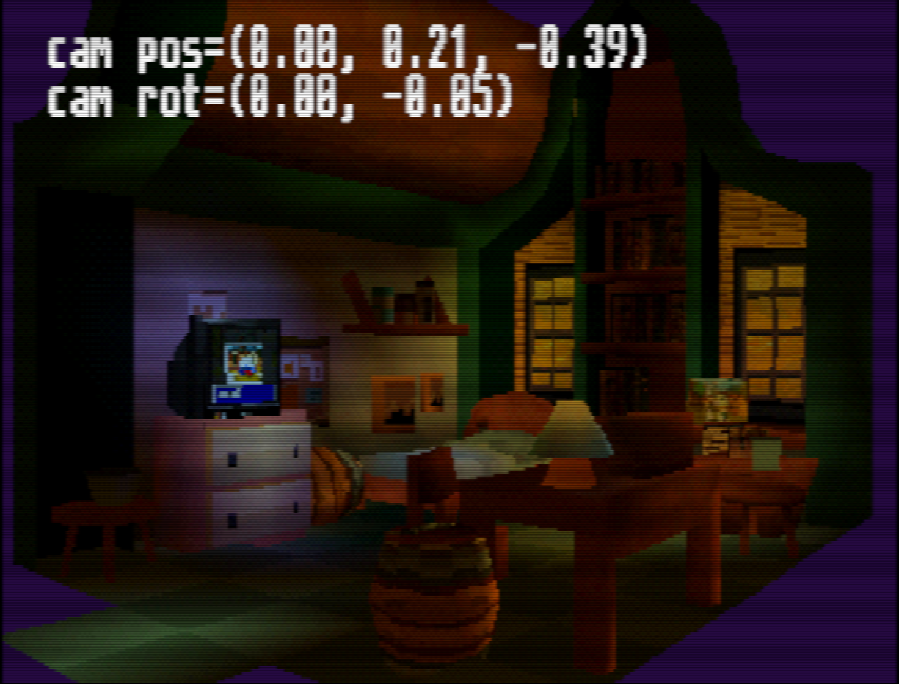
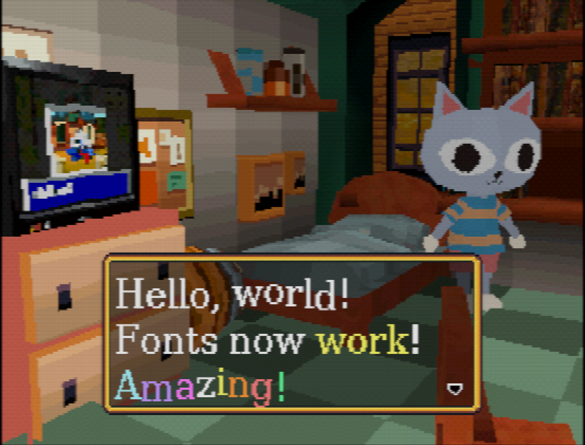

# PS1 dev

PS1 development experiments.

Done with psyqo, in C++20.

# Current progress





# Building with Docker

Building with Docker is extremely easy, just run:

```sh
./docker_build.sh
```

You'll find the resulting ISO(s) in `docker_out` directory.

# Requirements

1. [PCSX-Redux](https://github.com/grumpycoders/pcsx-redux)
2. CMake
3. gdb-multiarch
3. GCC MIPS toolchain
4. [mkpsxiso](https://github.com/Lameguy64/mkpsxiso) - included prebuilt in `tools/bin`
5. Use [psxavenc](https://github.com/WonderfulToolchain/psxavenc) for encoding sound files from .wav

```sh
sudo apt-get install gdb-multiarch gcc-mipsel-linux-gnu g++-mipsel-linux-gnu binutils-mipsel-linux-gnu libmagick++-dev
```

For now, only Linux build is supported.

# How to

Build:

```sh
./build.sh
```

* The tools are built in `build`. 
* The games will be built in `build_games/` (e.g. `build_games/cat_adventure/game.iso`)

Run:

```sh
./run.sh   # run in Redux
./drun.sh # run in DuckStation
```

Or just

```sh
./run.sh
```

Run game and debug in gdb (you will need to add repo's path to your GDB's `safe-path`):

```sh
./debug.sh
```

By default, the game is built with `-Os` which can be bad for debugging. In this case, run:

```sh
./debug.sh DEBUG
```

This will compile the game with `-O0` and debugging would be much pleasant.

Example of encoding audio:

```sh
./psxavenc -t vag -f 44100 ~/work/ps1dev/assets/raw/sounds/door_open.wav ~/work/ps1dev/assets/door_open.vag
```
