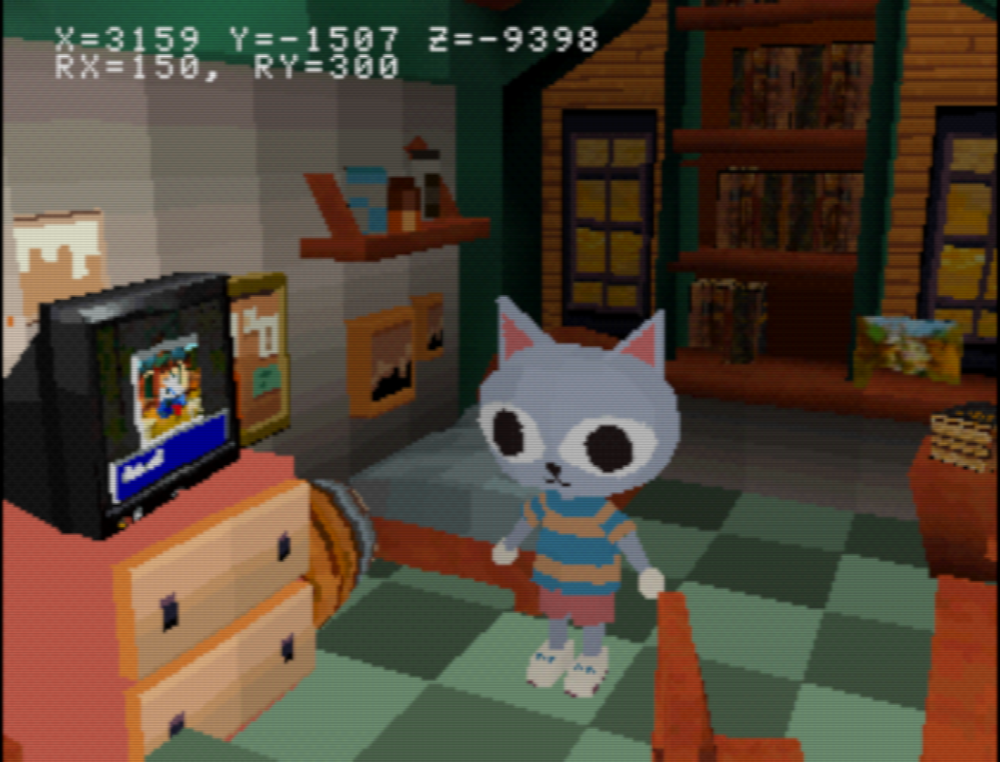

# PS1 dev

PS1 development experiments.

Done with psyqo, in C++20.

# Current progress



# Requirements


1. [PCSX-Redux](https://github.com/grumpycoders/pcsx-redux)
2. CMake
3. gdb-multiarch
3. GCC MIPS toolchain
4. [mkpsxiso](https://github.com/Lameguy64/mkpsxiso) - included prebuilt in `tools/bin`
5. Build [psxtools](https://github.com/eliasdaler/psxtools) and set `PSXTOOLS_BIN_DIR` to its location (`../psxtools/build` by default).
6. Use [psxavenc](https://github.com/WonderfulToolchain/psxavenc) for encoding sound files from .wav

```sh
sudo apt-get install gdb-multiarch gcc-mipsel-linux-gnu g++-mipsel-linux-gnu binutils-mipsel-linux-gnu libmagick++-dev
```

For now, only Linux build is supported.

# How to

Build:

```sh
./build.sh
```

Sorry, out of source build is not supported yet for my sanity.

Run:

```sh
./run.sh   # run in Redux
./debug.sh # run in DuckStation
```

Or just

```sh
./run.sh
```

Run game and debug in gdb (you will need to add repo's path to your GDB's `safe-path`):

```sh
./debug.sh
```

Example of encoding audio:

```sh
./psxavenc -t vag -f 44100 ~/work/ps1dev/assets/raw/sounds/door_open.wav ~/work/ps1dev/assets/door_open.vag
```
