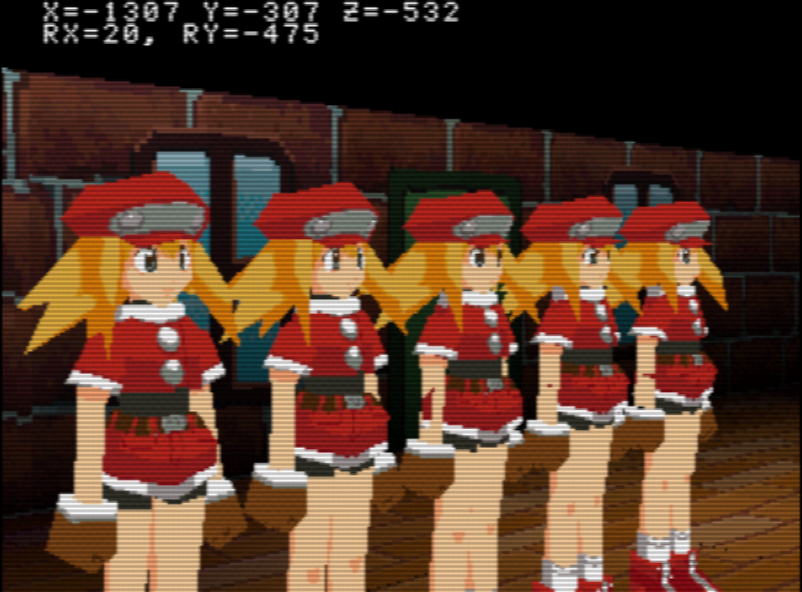

# PS1 dev

PS1 development experiments.

Done with converted PsyQ libs (nugget), in C++20, without libgs.

See also: [psxtools](https://github.com/eliasdaler/psxtools) (to be incorporated into build process).

# Current progress

(Roll model is from Mega Man Legends 2 and is used temporarily until I make my own models)



# Requirements

For now, only Linux build is supported.

1. [PCSX-Redux](https://github.com/grumpycoders/pcsx-redux)
2. CMake
3. gdb-multiarch
3. GCC MIPS toolchain
4. Download PsyQ converted libs from [here](http://psx.arthus.net/sdk/Psy-Q/psyq-4.7-converted-full.7z) and put it in `<cloned_repo_dir>/../psyq`. Alternatively you can set the PsyQ dir via `-DPSYQ_DIR` when generating CMake files.
5. [mkpsxiso](https://github.com/Lameguy64/mkpsxiso) - included prebuilt in `tools/bin`
6. Build [psxtools](https://github.com/eliasdaler/psxtools) and set `PSXTOOLS_BIN_DIR` to its location (`../psxtools/build` by default).
7. Use [psxavenc](https://github.com/WonderfulToolchain/psxavenc) for encoding sound files from .wav

```sh
sudo apt-get install gdb-multiarch gcc-mipsel-linux-gnu g++-mipsel-linux-gnu binutils-mipsel-linux-gnu
```

# How to

Build:

```sh
cmake --preset=default
cmake --build --preset=default
```

**Note**: if you're not using presets, your build dir should be named "build" or else mkpsxiso won't work properly.

Run:

```sh
pcsx-redux -exe build/game.ps-exe -run
```

Or just

```sh
./run.sh
```

Run game and debug in gdb (you will need to add repo's path to your GDB's `safe-path`):

```sh
./debug.sh
```
